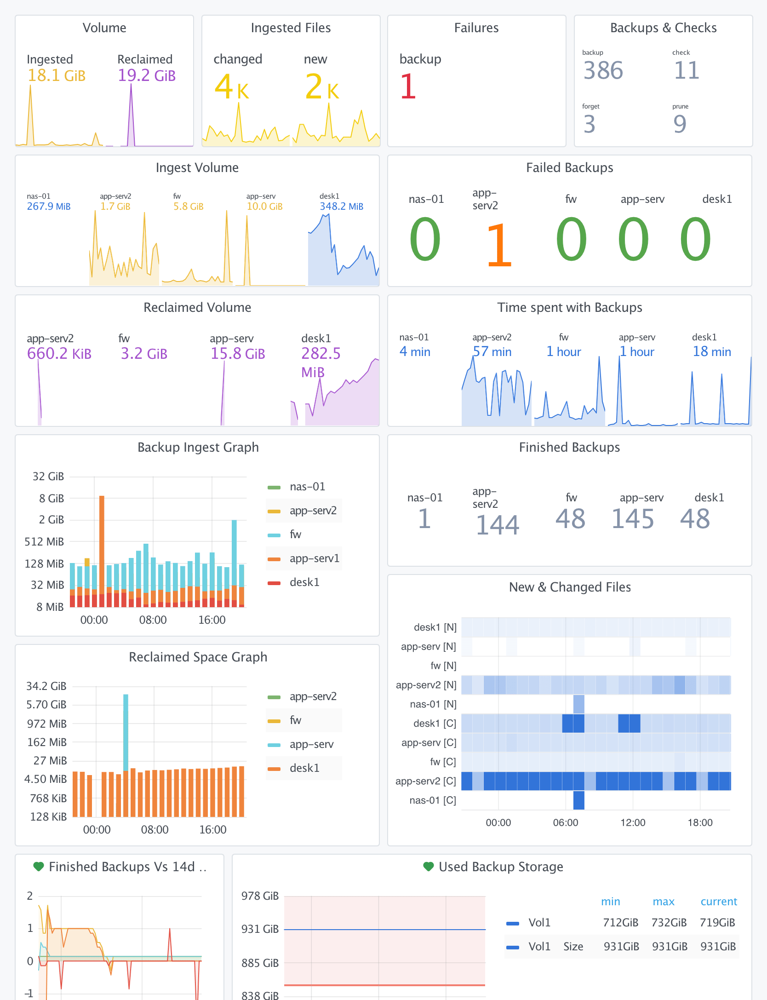

# Grafana / Loki - Dashboard

A [Grafana](https://grafana.com/oss/grafana/) dashboard that visualizes restic backups from captured log output.
The dashboard parses restic's stdout and requires that it is sent to [Loki](https://grafana.com/oss/loki/) (as part of syslog shipping).



## Requirements

* [Grafana](https://grafana.com/oss/grafana/)
* [Loki](https://grafana.com/oss/loki/) (& [Promtail](https://grafana.com/docs/loki/latest/clients/promtail/))
* restic(profile) output is sent sent to Loki (via Promtail)

## Configuration

### Grafana

Assuming a Loki datasource is already available, it is sufficient to import [dashboard.json](./dashboard.json). 

The dashboard uses bundled components only and was tested in Grafana 7.5 / Loki 2.0.

### Promtail

The dashboard requires Loki labels `app` and `host`. To extract them from `syslog` messages, please apply the following Promtail configuration (see also [promtail.yaml](./config/loki/promtail.yaml)):

```yaml
...
scrape_configs:
  - job_name: syslog
    ...
    relabel_configs:
      - source_labels: ['__syslog_message_hostname']
        target_label: 'host'
      - source_labels: ['__syslog_message_app_name']
        target_label: 'app'
```

### Log shipping

Please check your OS how to redirect resticprofile output to syslog. 

E.g. when running scheduled backups with `systemd`, it is sufficient to configure log shipping of `systemd` output to Loki (e.g. setup rsyslog with TCP to Promtail). 

Check the demo below for a working example (using docker).

## Features

* Visualizations
  * Filter by single/multiple hosts
  * Ingest/reclaimed volume and file counts
  * Success & error counts (by operation)
  * Time spent with backups

* Alerts
  * Backup-count diff graph - triggers when less backups arrive than expected by the 14d average of a host


## Demo

This working [docker-stack](./docker-compose.yaml) demonstrates how to configure Grafana / Loki & Promtail

### Startup

* [Download](https://github.com/creativeprojects/resticprofile/archive/refs/heads/master.zip) (or clone) this repo
* `cd contrib/grafana`
* `docker-compose up`

### Setup

When all containers started successfully, apply the following initial config to get the dashboard setup and running:

* Login to Grafana: http://localhost:3000 (defaults to "`admin`" for username and password)  
* Go to "Configuration / DataSources / Add" and add Loki with URL: \
  `http://172.36.12.3:3100`
* Go to "Explore / Loki" and check that logs from resticprofile are received when searching with:\
 `{app="resticprofile"}`
* To create the dashboard "Restic Backup":\
  Go to http://localhost:3000/dashboard/import and upload [dashboard.json](./dashboard.json)
