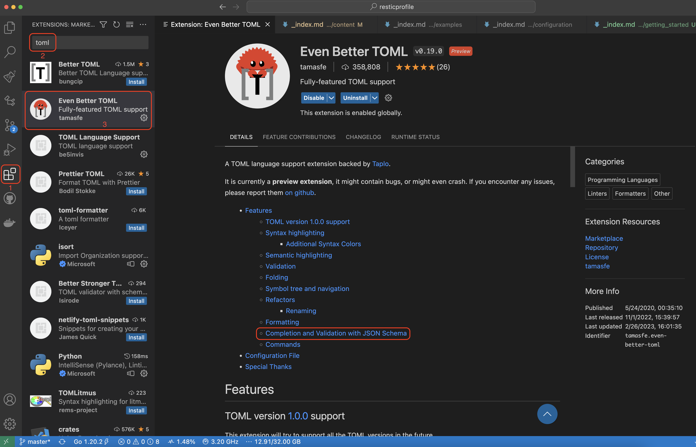
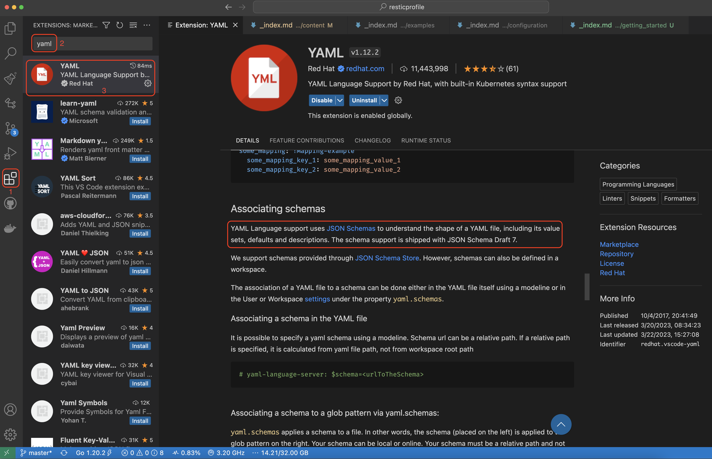

## Prerequisite

**resticprofile** is one of many automation tools for restic, also called a *wrapper*.

In a nutshell, **resticprofile** provides a configuration file and a runner that will generate all the necessary calls to **restic**.

Unless you're using the **resticprofile** [Docker image](), you need to have **restic** [installed on your machine](https://restic.readthedocs.io/en/stable/).

## Choose your favourite format

**resticprofile** configuration file can be written in:
* [TOML](https://github.com/toml-lang/toml) : configuration file with extension _.toml_ or _.conf_
* [YAML](https://en.wikipedia.org/wiki/YAML) : configuration file with extension _.yaml_
* [JSON](https://en.wikipedia.org/wiki/JSON) : configuration file with extension _.json_
* [HCL](https://github.com/hashicorp/hcl): configuration file with extension _.hcl_

We recommend using either TOML or YAML.

JSON is fine for auto generated configurations but is not the easiest format for a human to read and write.

HCL can be interesting if you already use a tool from the Hashicorp stack otherwise that's yet another format to learn.

## Configure your text editor

We're going to show you how to get documentation and auto-completion for the **resticprofile** configuration using [Visual Studio Code](https://code.visualstudio.com/).

You can use any other editor that recognise the [JSON schema](). The same JSON schema can be used for JSON, TOML and YAML file formats.

### TOML

In Visual Studio Code, you need to install an extension that supports completion and syntax validation using a JSON schema.

For example you can install the [Even Better TOML](https://marketplace.visualstudio.com/items?itemName=tamasfe.even-better-toml) extension:



### YAML

Same for YAML: in Visual Studio Code you need to install an extension like the one [provided by Red Hat](https://marketplace.visualstudio.com/items?itemName=redhat.vscode-yaml) to understand the shape of your configuration file.



## Write your first configuration file

The configuration file is essentially a list of profiles containing a list of commands and flags.

A profile defines:
* a restic repository (flag `repository`)
* how to access your restic repository (like `password-file`)
* a list of commands (like `backup`):
    * which files to include in a backup (flag `source`)
    * when to backup them (we'll see that later)
    * any other restic flags you would add to the command line (like `verbose`)

In this example, we're going to call our profile `default`. You don't need to specify the profile name on the command line when using this name (`default`).

Create a file named `profiles` with the extension of your choice (.toml, .yaml, .hcl or .json)


{}

```toml
#:schema 
#
# indentation is not needed but it makes it easier to read ;)
#
version = "1"

[default]
  repository = "local:/backup"
  password-file = "password.txt"

  [default.backup]
    verbose = true
    source = [ "/home" ]
```

{}
{}

```yaml
# yaml-language-server: $schema=

version: "1"

default:
  repository: "local:/backup"
  password-file: "password.txt"

  backup:
    verbose: true
    source:
      - "/home"
```

{}
{}

```hcl
default {
    repository = "local:/backup"
    password-file = "password.txt"

    backup = {
        verbose = true
        source = [ "/home" ]
    }
}
```

{}
{}

```json
{
  "$schema": "",
  "version": "1",
  "default": {
    "repository": "local:/backup",
    "password-file": "password.txt",
    "backup": {
      "verbose": true,
      "source": [
        "/home"
      ]
    }
  }
}
```

{}
{}

## Generate a secure password

**resticprofile** has a handy command that can generate a [cryptographically secure password file]() for you:

```shell
resticprofile generate --random-key > password.txt
```

## Initialize your repository

Now that you have a password file, you can initialize your restic repository:

```shell
resticprofile init
```

Here's an example of the result:
```
2023/03/25 15:46:48 using configuration file: profiles.yaml
2023/03/25 15:46:48 profile 'default': starting 'init'
created restic repository e21ab75046 at local:/backup

Please note that knowledge of your password is required to access
the repository. Losing your password means that your data is
irrecoverably lost.
2023/03/25 15:46:51 profile 'default': finished 'init'
```

## Test your first backup

Before going live, you can *dry run* your first backup by using the **resticprofile** `--dry-run` flag.

```shell
resticprofile --dry-run backup
```

And here's the result:
```
2023/03/25 15:49:51 using configuration file: profiles.yaml
2023/03/25 15:49:51 profile 'default': starting 'backup'
2023/03/25 15:49:51 dry-run: /usr/local/bin/restic backup --password-file password.txt --repo local:/backup --verbose /home
2023/03/25 15:49:51 profile 'default': finished 'backup'
```

As you can see, **resticprofile** converted your backup profile into this command line:
```shell
/usr/local/bin/restic backup --password-file password.txt --repo local:/backup --verbose /home
```

## Flags

Let's stop a moment and analyse the command line: we passed the flag `--dry-run` **before the command** `backup`: it means the flag is used by **resticprofile**.

Let's try again with the flag after the command:

```shell
resticprofile backup --dry-run
```

And the result is rather different:

```
2023/03/25 15:50:02 using configuration file: profiles.yaml
2023/03/25 15:50:02 profile 'default': starting 'backup'
open repository
repository e22aa770 opened (version 2, compression level auto)
created new cache in /Users/CP/Library/Caches/restic
lock repository
no parent snapshot found, will read all files
load index files
start scan on [/home]
start backup on [/home]
scan finished in 0.202s: 0 files, 0 B

Files:           0 new,     0 changed,     0 unmodified
Dirs:            0 new,     0 changed,     0 unmodified
Data Blobs:      0 new
Tree Blobs:      1 new
Would add to the repository: 346 B (292 B stored)

processed 0 files, 0 B in 0:00
2023/03/25 15:50:03 profile 'default': finished 'backup'
```

If you add flags **after the command**, the flags will be sent to **restic** instead. As you can see, **restic** simulated a backup of your `/home` folder.

## Schedule

Let's imagine you want to backup your files every day during your lunch break.

Add a line in your configuration (in the **default -> backup** section) with an option called `schedule` and a value of `12:30`. Your configuration should now look like:



{}

```toml
#:schema 
#
# indentation is not needed but it makes it easier to read ;)
#
version = "1"

[default]
  repository = "local:/backup"
  password-file = "password.txt"

  [default.backup]
    verbose = true
    source = [ "/home" ]
    schedule = "12:30"
```

{}
{}

```yaml
# yaml-language-server: $schema=

version: "1"

default:
  repository: "local:/backup"
  password-file: "password.txt"

  backup:
    verbose: true
    source:
      - "/home"
    schedule: "12:30"
```

{}
{}

```hcl
default {
    repository = "local:/backup"
    password-file = "password.txt"

    backup = {
        verbose = true
        source = [ "/home" ]
        schedule = "12:30"
    }
}
```

{}
{}

```json
{
  "$schema": "",
  "version": "1",
  "default": {
    "repository": "local:/backup",
    "password-file": "password.txt",
    "backup": {
      "verbose": true,
      "source": [
        "/home"
      ],
      "schedule": "12:30"
    }
  }
}
```

{}
{}

**resticprofile** can [schedule]() work on macOS, Windows, most Unixes and Linux distributions: it is simply adding an entry in the default scheduler of your platform.

To schedule the backup of the default profile, simply type the command:

```shell
resticprofile schedule
```

Now your backup will run every day at 12:30. As simple as that!

## Inline help

You can get help for any command at any time.

The help is available for both the **resticprofile** internal commands and all the **restic** commands.


### resticprofile help

To get the help on a **resticprofile** command, simply use the `help command` or `command -h`:

Example:
```
$ resticprofile help generate

The "generate" command is used to create various resources and print them to stdout

Usage:
  resticprofile [resticprofile flags] generate [command specific flags]

Flags:
  --bash-completion                               generate a shell completion script for bash
  --config-reference [--version 0.15] [template]  generate a config file reference from a go template (defaults to the built-in markdown template when omitted)
  --json-schema [--version 0.15] [v1|v2]          generate a JSON schema that validates resticprofile configuration files in YAML or JSON format
  --random-key [size]                             generate a cryptographically secure random key to use as a restic keyfile (size defaults to 1024 when omitted)
  --zsh-completion                                generate a shell completion script for zsh

```

### restic help

This is the same syntax to display the help from a **restic** command:

```
$ resticprofile init -h

The "init" command initializes a new repository.

EXIT STATUS
===========

Exit status is 0 if the command was successful, and non-zero if there was any error.

Usage:
  resticprofile [resticprofile flags] [profile name.]init [flags]

Flags:
[...]

```

## Next

Let's have a look at some [examples]()
