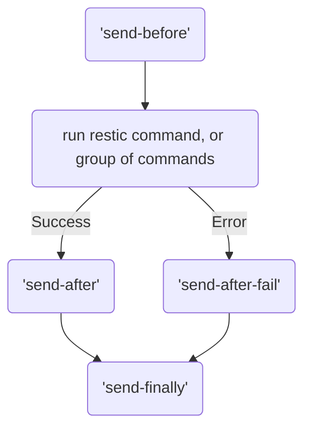

## Send HTTP messages before and after a command

As well as being able to run [shell commands](), you can now send HTTP messages before, after (success or failure) running a restic command.

The sections that allow sending HTTP hooks are:
- backup
- copy
- check
- forget
- prune

You might notice that's also the same sections that can be scheduled

Each of these commands can send 4 different types of hooks:

- send-before
- send-after
- send-after-fail
- send-finally

The configuration is the same for each of these 4 types of hooks:

| Name | Required | Default | Notes |
|:-----|:---------|:--------|:------|
| url | Yes | None | URL of your Webhook |
| method | No | GET | this is the HTTP method (GET, POST, HEAD, etc.) |
| skip-tls-verification | No | False | Use only if you're using your own server with a self-signed certificate: **This is not recommended** |
| headers | No | User-Agent set to resticprofile | This is a subsection with a list of `name` and `value` |
| body | No | Empty | Used to send data tp the Webhook (POST, PUT, PATCH) |
| body-template | No | None | Template file to generate the body (in go template format) |



{}

```toml
[profile]
inherit = "default"

  [profile.backup]
  source = "/source"
  exclude = [ "/**/.git/" ]
  schedule = [ "*:00,30" ]
  schedule-permission = "user"

    # you can have more than one target

    [[profile.backup.send-before]]
    method = "HEAD"
    url = "https://hc-ping.com/831e288e-1293-46f8-ac31-70ea7f875650/start"

    [[profile.backup.send-before]]
    method = "HEAD"
    url = "https://httpstat.us/400"

    # you can have more than one target

    [[profile.backup.send-after]]
    method = "HEAD"
    url = "https://hc-ping.com/831e288e-1293-46f8-ac31-70ea7f875650"

    [[profile.backup.send-after]]
    method = "HEAD"
    url = "https://httpstat.us/500"

    [profile.backup.send-after-fail]
    method = "POST"
    url = "https://hc-ping.com/831e288e-1293-46f8-ac31-70ea7f875650/fail"
    body = "${ERROR}\n\n${ERROR_STDERR}"

      [[profile.backup.send-after-fail.headers]]
      name = "Content-Type"
      value = "text/plain; charset=UTF-8"

  [profile.check]
  schedule = [ "*:15" ]

    [profile.check.send-before]
    method = "HEAD"
    url = "https://hc-ping.com/e0f62e41-b75f-450f-8cdd-7f25e466d2dc/start"

    [profile.check.send-after]
    method = "HEAD"
    url = "https://hc-ping.com/e0f62e41-b75f-450f-8cdd-7f25e466d2dc"

  [profile.retention]
  after-backup = true


```

{}
{}

```yaml
profile:
    inherit: default

    backup:
        source: "/source"
        exclude:
          - "/**/.git/"
        schedule:
          - "*:00,30"
        schedule-permission: user

        # you can have more than one target
        send-before:
          - method: HEAD
            url: https://hc-ping.com/831e288e-1293-46f8-ac31-70ea7f875650/start
          - method: HEAD
            url: https://httpstat.us/400

        # you can have more than one target
        send-after:
          - method: HEAD
            url: https://hc-ping.com/831e288e-1293-46f8-ac31-70ea7f875650
          - method: HEAD
            url: https://httpstat.us/500

        send-after-fail:
            method: POST
            url: https://hc-ping.com/831e288e-1293-46f8-ac31-70ea7f875650/fail
            body: "${ERROR}\n\n${ERROR_STDERR}"
            headers:
              - name: Content-Type
                value: "text/plain; charset=UTF-8"
    check:
        schedule:
          - "*:15"

        send-before:
          method: HEAD
          url: https://hc-ping.com/e0f62e41-b75f-450f-8cdd-7f25e466d2dc/start

        send-after:
          method: HEAD
          url: https://hc-ping.com/e0f62e41-b75f-450f-8cdd-7f25e466d2dc
    retention:
        after-backup: true

```

{}
{}

```hcl
"profile" {
  "inherit" = "default"

  "backup" = {
    "source" = "/source"
    "exclude" = ["/**/.git/"]
    "schedule" = ["*:00,30"]
    "schedule-permission" = "user"

    "send-before" = {
      "method" = "HEAD"
      "url" = "https://hc-ping.com/831e288e-1293-46f8-ac31-70ea7f875650/start"
    }

    "send-before" = {
      "method" = "HEAD"
      "url" = "https://httpstat.us/400"
    }

    "send-after" = {
      "method" = "HEAD"
      "url" = "https://hc-ping.com/831e288e-1293-46f8-ac31-70ea7f875650"
    }

    "send-after" = {
      "method" = "HEAD"
      "url" = "https://httpstat.us/500"
    }

    "send-after-fail" = {
      "method" = "POST"
      "url" = "https://hc-ping.com/831e288e-1293-46f8-ac31-70ea7f875650/fail"
      "body" = "${ERROR}\n\n${ERROR_STDERR}"
      "headers" = {
        "name" = "Content-Type"
        "value" = "text/plain; charset=UTF-8"
      }
    }
  }

  "check" = {
    "schedule" = ["*:15"]

    "send-before" = {
      "method" = "HEAD"
      "url" = "https://hc-ping.com/e0f62e41-b75f-450f-8cdd-7f25e466d2dc/start"
    }

    "send-after" = {
      "method" = "HEAD"
      "url" = "https://hc-ping.com/e0f62e41-b75f-450f-8cdd-7f25e466d2dc"
    }
  }

  "retention" = {
    "after-backup" = true
  }
}
```

{}
{}

```json
{
  "profile": {
    "inherit": "default",
    "backup": {
      "source": "/source",
      "exclude": [
        "/**/.git/"
      ],
      "schedule": [
        "*:00,30"
      ],
      "schedule-permission": "user",
      "send-before": [
        {
          "method": "HEAD",
          "url": "https://hc-ping.com/831e288e-1293-46f8-ac31-70ea7f875650/start"
        },
        {
          "method": "HEAD",
          "url": "https://httpstat.us/400"
        }
      ],
      "send-after": [
        {
          "method": "HEAD",
          "url": "https://hc-ping.com/831e288e-1293-46f8-ac31-70ea7f875650"
        },
        {
          "method": "HEAD",
          "url": "https://httpstat.us/500"
        }
      ],
      "send-after-fail": {
        "method": "POST",
        "url": "https://hc-ping.com/831e288e-1293-46f8-ac31-70ea7f875650/fail",
        "body": "${ERROR}\n\n${ERROR_STDERR}",
        "headers": [
          {
            "name": "Content-Type",
            "value": "text/plain; charset=UTF-8"
          }
        ]
      }
    },
    "check": {
      "schedule": [
        "*:15"
      ],
      "send-before": {
        "method": "HEAD",
        "url": "https://hc-ping.com/e0f62e41-b75f-450f-8cdd-7f25e466d2dc/start"
      },
      "send-after": {
        "method": "HEAD",
        "url": "https://hc-ping.com/e0f62e41-b75f-450f-8cdd-7f25e466d2dc"
      }
    },
    "retention": {
      "after-backup": true
    }
  }
}
```

{}
{}


A few environment variables will be available:
- `PROFILE_NAME`
- `PROFILE_COMMAND`: backup, check, forget, etc.

Additionally, for the `send-after-fail` hooks, these environment variables will also be available:
- `ERROR` containing the latest error message
- `ERROR_COMMANDLINE` containing the command line that failed
- `ERROR_EXIT_CODE` containing the exit code of the command line that failed
- `ERROR_STDERR` containing any message that the failed command sent to the standard error (stderr)

The commands of `send-finally` get the environment of `send-after-fail` when `run-before`, `run-after` or `restic` failed. 

Failures in any `send-*` are logged but do not influence environment or return code.

### order of `send-*`

Here's the flow of HTTP hooks:

