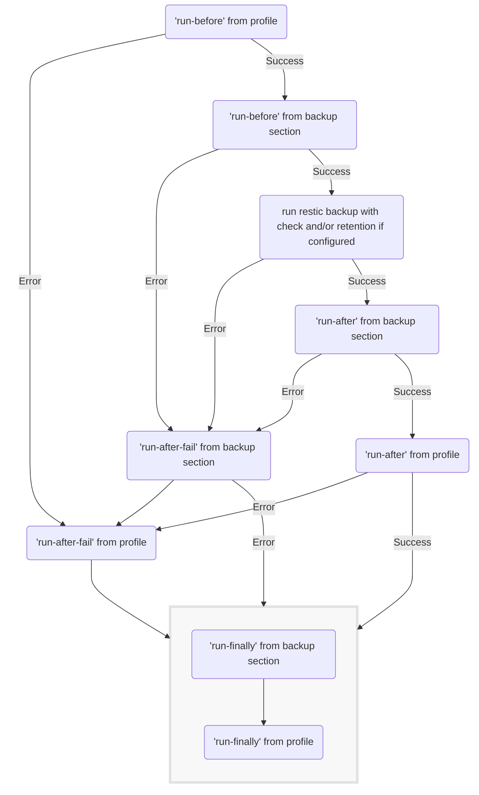

## Run commands before, after success or after failure

resticprofile has 2 places where you can run commands around restic:

- commands that will run before and after every restic command (snapshots, backup, check, forget, prune, mount, etc.). These are placed at the root of each profile and are always considered.
- commands that will only run before and after specific restic commands. These are placed in supported sections of your profiles (currently supported are `backup`, `copy`, `dump`, `find`, `ls`, `mount`, `restore`, `snapshots`, `stats` and `tag`).

Here's an example of all the external commands that you can run during the execution of a profile:


{}

```toml
[documents]
  inherit = "default"
  run-before = 'echo "== run-before profile $PROFILE_NAME and command $PROFILE_COMMAND"'
  run-after = 'echo "== run-after profile $PROFILE_NAME and command $PROFILE_COMMAND"'
  run-after-fail = 'echo "== ERROR in profile $PROFILE_NAME command ${PROFILE_COMMAND}: $ERROR_MESSAGE"'
  run-finally = 'echo "== run-finally from profile $PROFILE_NAME after command $PROFILE_COMMAND"'

  [documents.backup]
    run-before = 'echo "=== run-before backup in profile $PROFILE_NAME"'
    run-after = 'echo "=== run-after backup in profile $PROFILE_NAME"'
    run-after-fail = 'echo "=== ERROR in backup for profile ${PROFILE_NAME}: $ERROR_MESSAGE"'
    run-finally = 'echo "=== run-finally after backup in profile $PROFILE_NAME"'
    source = "~/Documents"

```

{}
{}

```yaml
documents:
  inherit: default
  run-before: 'echo "== run-before profile $PROFILE_NAME and command $PROFILE_COMMAND"'
  run-after: 'echo "== run-after profile $PROFILE_NAME and command $PROFILE_COMMAND"'
  run-after-fail: 'echo "== ERROR in profile $PROFILE_NAME command ${PROFILE_COMMAND}: $ERROR_MESSAGE"'
  run-finally: 'echo "== run-finally from profile $PROFILE_NAME after command $PROFILE_COMMAND"'

  backup:
    run-before: 'echo "=== run-before backup in profile $PROFILE_NAME"'
    run-after: 'echo "=== run-after backup in profile $PROFILE_NAME"'
    run-after-fail: 'echo "=== ERROR in backup for profile ${PROFILE_NAME}: $ERROR_MESSAGE"'
    run-finally: 'echo "=== run-finally after backup in profile $PROFILE_NAME"'
    source: ~/Documents
```

{}
{}

```hcl
documents {
    inherit = "default"
    run-before = "echo \"== run-before profile $PROFILE_NAME and command $PROFILE_COMMAND\""
    run-after = "echo \"== run-after profile $PROFILE_NAME and command $PROFILE_COMMAND\""
    run-after-fail = "echo \"== ERROR in profile $PROFILE_NAME command ${PROFILE_COMMAND}: $ERROR_MESSAGE\""
    run-finally = "echo \"== run-finally from profile $PROFILE_NAME after command $PROFILE_COMMAND\""

    backup = {
        run-before = "echo \"=== run-before backup in profile $PROFILE_NAME\""
        run-after = "echo \"=== run-after backup in profile $PROFILE_NAME\""
        run-after-fail = "echo \"=== ERROR in backup for profile ${PROFILE_NAME}: $ERROR_MESSAGE\""
        run-finally = "echo \"=== run-finally after backup in profile $PROFILE_NAME\""
        source = "~/Documents"
    }
}
```

{}
{}

```json
{
  "documents": {
    "inherit": "default",
    "run-before": "echo \"== run-before profile $PROFILE_NAME and command $PROFILE_COMMAND\"",
    "run-after": "echo \"== run-after profile $PROFILE_NAME and command $PROFILE_COMMAND\"",
    "run-after-fail": "echo \"== ERROR in profile $PROFILE_NAME command ${PROFILE_COMMAND}: $ERROR_MESSAGE\"",
    "run-finally": "echo \"== run-finally from profile $PROFILE_NAME after command $PROFILE_COMMAND\"",
    "backup": {
      "run-before": "echo \"=== run-before backup in profile $PROFILE_NAME\"",
      "run-after": "echo \"=== run-after backup in profile $PROFILE_NAME\"",
      "run-after-fail": "echo \"=== ERROR in backup for profile ${PROFILE_NAME}: $ERROR_MESSAGE\"",
      "run-finally": "echo \"=== run-finally after backup in profile $PROFILE_NAME\"",
      "source": "~/Documents"
    }
  }
}
```

{}
{}

`run-before`, `run-after`, `run-after-fail` and `run-finally` can be a string, or an array of strings if you need to run more than one command

A few environment variables will be set before running these commands:
- `PROFILE_NAME`
- `PROFILE_COMMAND`: backup, check, forget, etc.

Additionally, for the `run-after-fail` commands, these environment variables will also be available:
- `ERROR_MESSAGE` (and `ERROR`) containing the latest error message
- `ERROR_COMMANDLINE` containing the command line that failed
- `ERROR_EXIT_CODE` containing the exit code of the command line that failed
- `ERROR_STDERR` containing any message that the failed command sent to the standard error (stderr)

The commands of `run-finally` get the environment of `run-after-fail` when `run-before`, `run-after` or `restic` failed. 

Failures to run commands in `run-finally` are logged but do not influence environment, return code nor running of further commands listed in `run-finally`. This makes it the perfect choice for custom cleanup tasks that must always run. 

All other command errors (= non-zero return code from a command) will skip running further commands in the same list and/or abort the flow. 

### Output when running the example from above

```shell
➜ resticprofile documents.backup
== run-before profile documents and command backup
=== run-before backup in profile documents
...
processed 355 files, 11.722 MiB in 0:00
snapshot 3949d2fb saved
...
=== run-after backup in profile documents
== run-after profile documents and command backup
=== run-finally after backup in profile documents
== run-finally from profile documents after command backup
```

### Order of `run-*` during a backup

The commands will be running in this order **during a backup**:
- `run-before` from the profile - if error, go to `run-after-fail`
- `run-before` from the backup section - if error, go to `run-after-fail` from backup section
- run the restic backup (with check and retention if configured) - if error, go to `run-after-fail` from backup section
- `run-after` from the backup section - if error, go to `run-after-fail` from backup section
- `run-after` from the profile - if error, go to `run-after-fail`
- If error: `run-after-fail` from the backup section - if error, go to `run-finally`
- If error: `run-after-fail` from the profile - if error, go to `run-finally`
- `run-finally` from the backup section - if error, log and continue with next
- `run-finally` from the profile - if error, log and continue with next

Maybe it's easier to understand with a flow diagram:





## Run commands on stream errors

In addition to hooks around profile and command execution, resticprofile allows to monitor the standard error stream of the current running command and trigger a custom hook when an output error line matches a regular expression pattern.


{}

```toml
[default]

[[default.stream-error]]
pattern = ".+ERROR.+"
run = 'echo "Found ERROR at least 5 times in ${PROFILE_COMMAND}. Last matched line:"; cat - '
max-runs = 0
min-matches = 5
```

{}
{}

```yaml
default:
  stream-error:
    - pattern: ".+ERROR.+"
      run: 'echo "Found ERROR at least 5 times in ${PROFILE_COMMAND}. Last matched line:"; cat - '
      max-runs: 0
      min-matches: 5
```
{}
{}

```hcl
default {
  stream-error = {
      pattern = ".+ERROR.+" 
      run = "echo \"Found ERROR at least 5 times in ${PROFILE_COMMAND}. Last matched line:\"; cat - "
      max-runs = 0
      min-matches = 5
  }
}
```
{}
{}

```json
{
  "default": {
    "stream-error": [
      {
        "pattern": ".+ERROR.+",
        "run": "echo \"Found ERROR at least 5 times in ${PROFILE_COMMAND}. Last matched line:\"; cat - ",
        "max-runs": 0,
        "min-matches": 5
      }
    ]
  }
}
```
{}
{}

The config structure `stream-error` can be defined multiple times within a profile and consists of the following properties:
- `pattern`: a regular expression pattern matched against every line of stderr.
- `run`: the command to run when `pattern` is found in stderr.
- `max-runs`: maximum number of times that `run` is started for a single monitored command (or 0 for no limit).
- `min-matches`: minimum number of times that `pattern` must match before starting `run`.

The `run` command inherits the environment of the monitored command on a pattern match, which always includes:
- `PROFILE_NAME`
- `PROFILE_COMMAND`: backup, check, forget, etc.

*Stdin* of the `run` command is populated with the error output line that matched the `pattern`. Using `"cat -"` in `run` effectively prints the line that triggered the action.

The following example shows how this could have been used with restic to address `check` failures caused by over usage of `/tmp/` (restic fixed this problem in 0.14.0):


{}

```toml
[default]

[[default.stream-error]]
pattern = "/tmp/restic-check-cache.+no space left on device"
run = "rm -Rf /tmp/restic-check-cache*"

[[default.stream-error]]
pattern = "mkdir /tmp/restic-check-cache.+no such file or directory"
run = "cat - | cut -d : -f 2 - | grep -E 'mkdir /tmp[^ \\.]+$' | sed 's/mkdir/mkdir -p/' - | sh"
```

{}
{}

```yaml
default:
  stream-error:
    - pattern: "/tmp/restic-check-cache.+no space left on device"
      run: "rm -Rf /tmp/restic-check-cache*"
    - pattern: "mkdir /tmp/restic-check-cache.+no such file or directory"
      run: "cat - | cut -d : -f 2 - | grep -E 'mkdir /tmp[^ \\.]+$' | sed 's/mkdir/mkdir -p/' - | sh"
```

{}
{}
