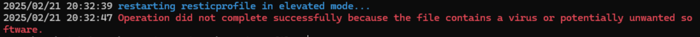
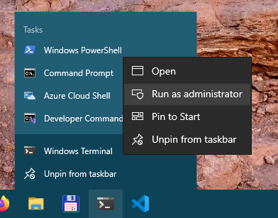
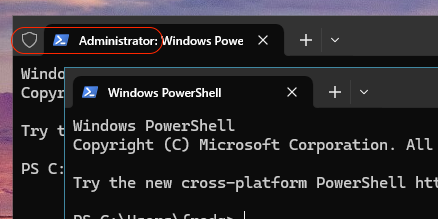

## Minimum version supported

Windows 10 is the minimum version supported for scheduling.

## Elevated mode

If your schedule profile has the permission set to `system`, resticprofile needs to run in elevated mode to set up the schedules.

Generally, you don't need to worry about this: resticprofile will restart itself in elevated mode. You'll see a popup window asking for elevated privileges.

### resticprofile is blocked from restarting in elevated mode

I can't prevent this without buying a developer certificate. If you know any free or cheap certificate for open-source software, please let me know.

#### Solution

You'll need to start an elevated shell yourself.

- Right-click on `Command Prompt`, `Windows Terminal`, or `Windows Powershell` (choose your favorite)
- Click on `Run as administrator`

It's easy to spot a terminal window opened with Administrator privileges:

> [!IMPORTANT]
> Running the schedule command might cause Windows to delete _resticprofile.exe_, treating it as a threat.
