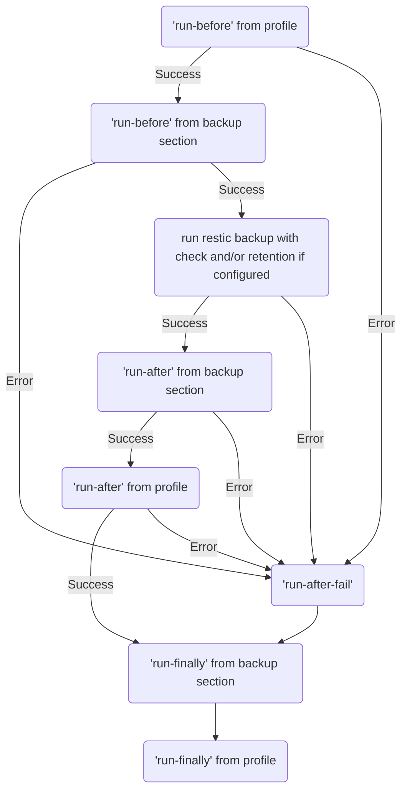

## Run commands before, after success or after failure

resticprofile has 2 places where you can run commands around restic:

- commands that will run before and after every restic command (snapshots, backup, check, forget, prune, mount, etc.). These are placed at the root of each profile.
- commands that will only run before and after a backup: these are placed in the backup section of your profiles.

Here's an example of all the external commands that you can run during the execution of a profile:


{}

```toml
[documents]
  inherit = "default"
  run-before = "echo == run-before profile $PROFILE_NAME command $PROFILE_COMMAND"
  run-after = "echo == run-after profile $PROFILE_NAME command $PROFILE_COMMAND"
  run-after-fail = "echo == Error in profile $PROFILE_NAME command $PROFILE_COMMAND: $ERROR"
  run-finally = "echo == run-finally $PROFILE_NAME command $PROFILE_COMMAND"

  [documents.backup]
    run-before = "echo === run-before backup profile $PROFILE_NAME command $PROFILE_COMMAND"
    run-after = "echo === run-after backup profile $PROFILE_NAME command $PROFILE_COMMAND"
    run-finally = "echo == run-finally $PROFILE_NAME command $PROFILE_COMMAND"
    source = "~/Documents"

```

{}
{}

```yaml
documents:
  inherit: default
  run-before: "echo == run-before profile $PROFILE_NAME command $PROFILE_COMMAND"
  run-after: "echo == run-after profile $PROFILE_NAME command $PROFILE_COMMAND"
  run-after-fail: "echo == Error in profile $PROFILE_NAME command $PROFILE_COMMAND: $ERROR"
  run-finally: "echo == run-finally $PROFILE_NAME command $PROFILE_COMMAND"

  backup:
    run-before: "echo === run-before backup profile $PROFILE_NAME command $PROFILE_COMMAND"
    run-after: "echo === run-after backup profile $PROFILE_NAME command $PROFILE_COMMAND"
    run-finally: "echo == run-finally $PROFILE_NAME command $PROFILE_COMMAND"
    source: ~/Documents
```

{}
{}

```hcl
documents {
    inherit = "default"
    run-before = "echo == run-before profile $PROFILE_NAME command $PROFILE_COMMAND"
    run-after = "echo == run-after profile $PROFILE_NAME command $PROFILE_COMMAND"
    run-after-fail = "echo == Error in profile $PROFILE_NAME command $PROFILE_COMMAND: $ERROR"
    run-finally = "echo == run-finally $PROFILE_NAME command $PROFILE_COMMAND"

    backup = {
        run-before = "echo === run-before backup profile $PROFILE_NAME command $PROFILE_COMMAND"
        run-after = "echo === run-after backup profile $PROFILE_NAME command $PROFILE_COMMAND"
        run-finally = "echo == run-finally $PROFILE_NAME command $PROFILE_COMMAND"
        source = "~/Documents"
    }
}
```

{}
{}

```json
{
  "documents": {
    "inherit": "default",
    "run-before": "echo == run-before profile $PROFILE_NAME command $PROFILE_COMMAND",
    "run-after": "echo == run-after profile $PROFILE_NAME command $PROFILE_COMMAND",
    "run-after-fail": "echo == Error in profile $PROFILE_NAME command $PROFILE_COMMAND: $ERROR",
    "run-finally": "echo == run-finally $PROFILE_NAME command $PROFILE_COMMAND",
    "backup": {
      "run-before": "echo === run-before backup profile $PROFILE_NAME command $PROFILE_COMMAND",
      "run-after": "echo === run-after backup profile $PROFILE_NAME command $PROFILE_COMMAND",
      "run-finally": "echo == run-finally $PROFILE_NAME command $PROFILE_COMMAND",
      "source": "~/Documents"
    }
  }
}
```

{}
{}

`run-before`, `run-after`, `run-after-fail` and `run-finally` can be a string, or an array of strings if you need to run more than one command

A few environment variables will be set before running these commands:
- `PROFILE_NAME`
- `PROFILE_COMMAND`: backup, check, forget, etc.

Additionally, for the `run-after-fail` commands, these environment variables will also be available:
- `ERROR` containing the latest error message
- `ERROR_COMMANDLINE` containing the command line that failed
- `ERROR_EXIT_CODE` containing the exit code of the command line that failed
- `ERROR_STDERR` containing any message that the failed command sent to the standard error (stderr)

The commands of `run-finally` get the environment of `run-after-fail` when `run-before`, `run-after` or `restic` failed. 
Failures in `run-finally` are logged but do not influence environment or return code.

### order of `run-*` during a backup

The commands will be running in this order **during a backup**:
- `run-before` from the profile - if error, go to `run-after-fail`
- `run-before` from the backup section - if error, go to `run-after-fail`
- run the restic backup (with check and retention if configured) - if error, go to `run-after-fail`
- `run-after` from the backup section - if error, go to `run-after-fail`
- `run-after` from the profile - if error, go to `run-after-fail`
- If error: `run-after-fail` from the profile - if error, go to `run-finally`
- `run-finally` from the backup section - if error, log and continue with next
- `run-finally` from the profile - if error, log and continue with next

Maybe it's easier to understand with a flow diagram:



