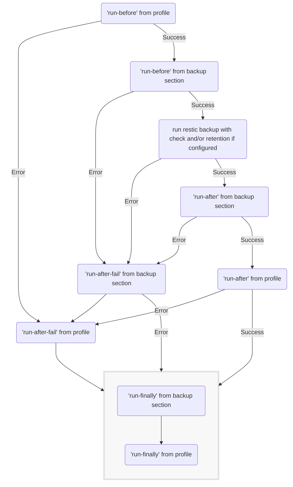

```mermaid
flowchart TB
    PRB('run-before' from profile)
    PRA('run-after' from profile)

    subgraph Backup [ ]
        BRB('run-before' from backup section)
        BRA('run-after' from backup section)
        RUN(run restic backup with check and/or retention if configured)
    end

    subgraph Failure [ ]
        BFAIL('run-after-fail' from backup section)
        PFAIL('run-after-fail' from profile)
    end

    subgraph Finally [ ]
        direction TB
        BRF('run-finally' from backup section)
        PRF('run-finally' from profile)
        BRF --> PRF
    end

    PRB -->|Error| PFAIL
    PRB -->|Success| BRB

    BRB -->|Error| BFAIL
    BRB -->|Success| RUN

    RUN -->|Error| BFAIL
    RUN -->|Success| BRA

    BRA -->|Error| BFAIL
    BRA -->|Success| PRA

    BFAIL -->|Error| Finally
    BFAIL --> PFAIL

    PRA -->|Error| PFAIL
    PRA -->|Success| Finally
    PFAIL --> Finally

    style Backup fill:#9990,stroke:#9990
    style Failure fill:#9990,stroke:#9990
    style Finally fill:#9991,stroke:#9994,stroke-width:4px
```
