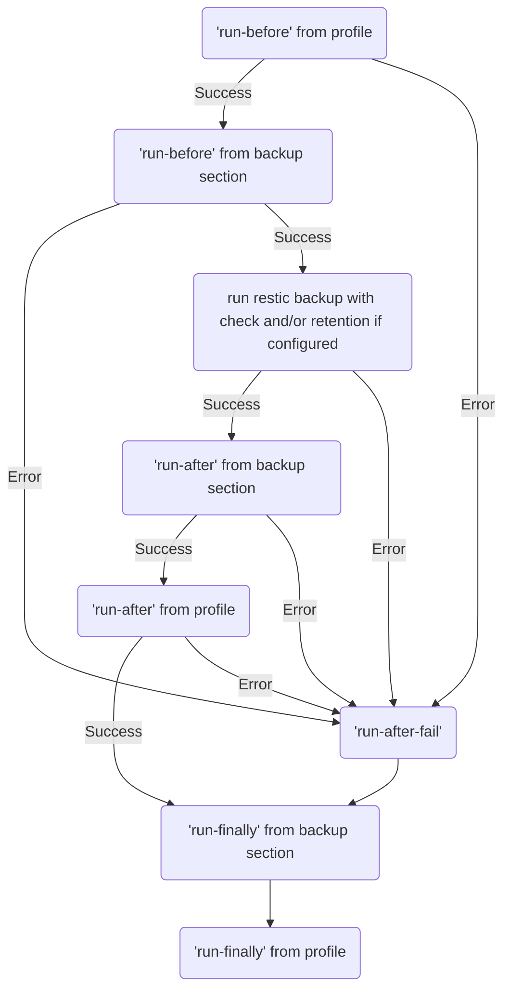

```mermaid
graph TD
    PRB('run-before' from profile) -->|Success| BRB('run-before' from backup section)
    PRB -->|Error| FAIL('run-after-fail')
    BRB -->|Error| FAIL('run-after-fail')
    BRB -->|Success| RUN(run restic backup with check and/or retention if configured)
    RUN -->|Success| BRA
    RUN -->|Error| FAIL('run-after-fail')
    BRA('run-after' from backup section)
    BRA -->|Success| PRA
    BRA -->|Error| FAIL('run-after-fail')
    PRA('run-after' from profile)
    PRA -->|Success| BRF
    PRA -->|Error| FAIL('run-after-fail')
    BRF('run-finally' from backup section)
    BRF --> PRF
    PRF('run-finally' from profile)
    FAIL --> BRF
```
